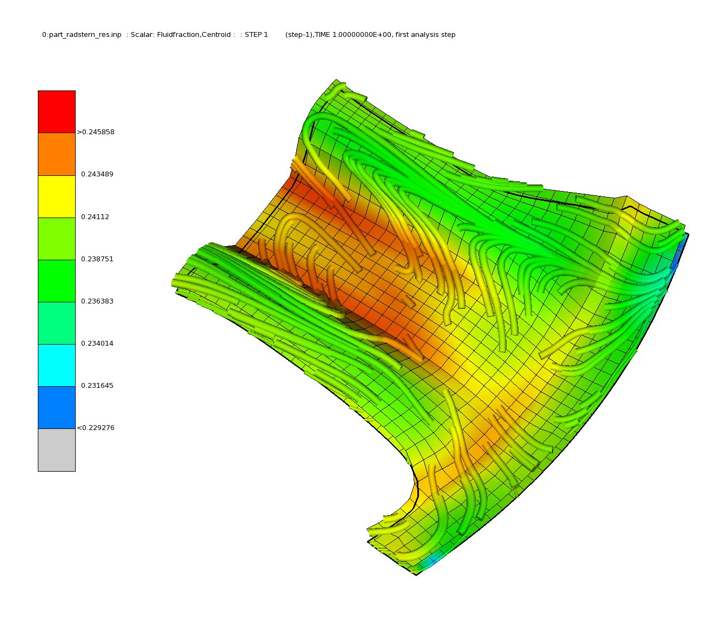

# resin_transfer_tpm_aniso

The code compiled with makefile Intel_TPM_CAN_RTM_MAKEFILE performs resin transfer molding simulation based on the following:

* cauchy equation of motion
* basic principles of thermodynamics
* taking into account of anisotropic permeability of the structure

The theory of the whole can be taken from:
https://mediatum.ub.tum.de/doc/1230956/1230956.pdf

Fluid Fraction and streaklines:

Fluid Fraction and streamlines:

pore pressure: 

